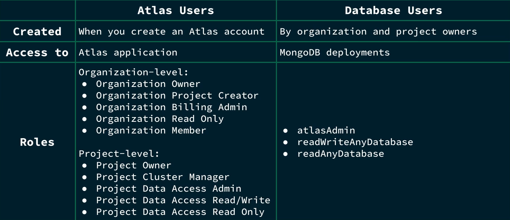
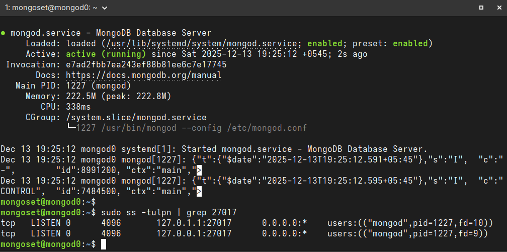

# MongoDB Atlas Administrator Path

For the latest and most updated docs, visit: https://www.mongodb.com/docs/

## 1. Setup Atlas CLI
Installing Atlas CLI may also install `mongosh`, so this step might be unnecessary. <br>
Adding the following yum repo might still be useful if you have intension to install **MongoDB Community Server**.<br> 

Create a `/etc/yum.repos.d/mongodb-org-8.2.repo` file with contents as:
```ini
[mongodb-org-8.2]
name=MongoDB Repository
baseurl=https://repo.mongodb.org/yum/redhat/8/mongodb-org/8.2/$basearch/
gpgcheck=1
enabled=1
gpgkey=https://www.mongodb.org/static/pgp/server-8.0.asc
```
Then install the latest stable version of `mongosh` as:
```
sudo yum install -y mongodb-mongosh
mongosh --version
```
Atlas CLI is a cli tool to interface with MongoDB Atlas; while `mongosh` is used for interacting with MongoDB Database.<br>
Install Atlas CLI in linux (Fedora in my case):
```
dnf install mongodb-atlas -y
atlas --version
```

## 2. Getting Started with Atlas CLI

### 1. To authenticate Atlas CLI with MongoDB Atlas account
```
atlas auth login
```
A one-time verification code is generated that can be pasted in the browser prompt to authenticate our account with the CLI. <br>

A default profile is created after authentication, which can be read using:
```
atlas config describe default
```

### 2. Create a Local environment for SDLC
1. To create a local development environment, we need to ensure Podman/Docker is up and running.
    ```
    systemctl status podman.socket
    podman --version
    ```
    Then deploy a new local deployment, **Dev**. We can initialize and populate the database with script inside `my-films-app/initdb-dev/loadFilms.js`:
    ```
    atlas deployments setup Dev --initdb my-films-app/initdb-dev
    ```
    **NOTE:** In my case, there was a bug that led to inability to parse my local timezone UTC+05:45 so I had to run:
    ```
    TZ=UTC atlas deployments setup Dev --initdb my-films-app/initdb-dev
    ```
2.  Choose local (Local Database) option and choose the default configuration. Now connect to the deployment with mongosh. Inside the mongosh, run: 
    ```
    show dbs
    ```
    And we will see our local database, my-films-db. Run the following command to choose that database:
    ```
    use my-films-db
    ```
    Now we can read all the inserted documents:
    ```
    db.films.find()
    ```
3. To run additional scripts after the deployment, run this inside mongosh:
    ```
    load ("<script_name>")
    ```
4. To exit mogosh, run:
    ```
    quit
    ```
### 3. Create a Cloud cluster using AWS/Azure/GCP for Testing
We will create a M0 cluster (free tiered) with AWS as Cloud Provider.
```
atlas deployments setup Test --type ATLAS --provider AWS --region AP-SOUTH-1 --mdbVersion 8.0 --tier M0 --skipSampleData
```
This creates a M0 cluster in Mumabi region of AWS with MongoDB version 8.0 with no sample data preloaded. Remember the Username and Password and keep it safe. Now to list all the deployments (local and cloud):
```
atlas deployments list
```
To connect to a deployment, run:
```
atlas deployment connect Test
```
You will be prompted to enter the Username and Password to create a connection.

### 4. Create a custom profile for automation 
We can generate a custom profile with a scoped RBAC (Role Based Access Control) with `APIKeys` as mode of authentication (since `UserAccount` authenticated session with one-time verification code expires in 12 hours). <br>
So, lets generate a set of public/private API key pairs with `GROUP_OWNER` role, for the custom profile (for example, automation):
```
atlas projects apiKeys create --role GROUP_OWNER --desc "API Key for automation"
```
Copy the public and private keys and run:
```
atlas config init --profile automation
```
Select `APIKeys` as authentication type and paste the keys when prompted. <br>

**NOTE:** Since my home WiFi network is behind a ISP's CGNAT (Carrier Grade NAT), my public IP address may change dynamically. And, Atlas doesn't support IPv6 yet.
So disable `Require IP Access List for the Atlas Administration API` toggle on Organizations Setting in [MongoDB Cloud](https://cloud.mongodb.com/) to prevent any security issues when setting up the profile, like unable to identify Organizations and Projects under the user account. <br> If it doesn't work, just add **0.0.0.0/0** (quad-zero) to the IP Access List in the Security Quickstarts. 

## 3. Security
Here is a brief overview of differences between Atlas Users and Database Users. The roles might have been updated but the cores differences remain the same.


In short, Database Users are separate from Atlas Users, because Database Users have access to MongoDB databases, while Atlas Users have access to the Atlas application itself.

### 1. Atlas User Management using CLI
1. To view the organizations in a plaintext, run:
    ```
    atlas organizations list --output plaintext
    ```
2. To invite the MongoDB user with the email user@example.com to the organization with ORG_OWNER access: we run:
    ```
    atlas organizations invitations invite user@example.com --orgId <Organization-ID> --role ORG_OWNER --output json
    ```
3. To retrieve the projects for a specific organization, we can run:
    ```
    atlas projects list --orgId <Organization-ID> --output plaintext
    ```
4. To invite the MongoDB user with the email user@example.com to the project with GROUP_READ_ONLY access, we can run:
    ```
    atlas projects invitations invite user@example.com --projectId <projectId> --role GROUP_READ_ONLY --output json
    ```
5. To list all the users in a project, run:
    ```
    atlas projects users list --projectId <projectId>
    ```
6. To delete a specific user from a project, we run:
    ```
    atlas projects delete <ID> --projectId <projectId>
    ```
### 2. Database User Management using CLI
MongoDB supports following authentication methods for Database Users:
- SCRAM (default)
- X.509
- Kerberos
- OIDC
- AWS IAM
- LDAP <br>

Unlike Atlas Users, we can also create temporary Database Users (like, for contractors) that expire in 6 hours, 1 day, or 1 week.

1. To add a Database User with a Built-In Role (e.g. AtlasAdmin role):
    ```
    atlas dbusers create atlasAdmin --username dba --password dba-pass --deleteAfter 2026-01-14  --projectId <projectId>
    ```
2. To add an IP Address to the Access List:
    ```
    atlas accessList create <ip> --type ipAddress --projectId <projectId>
    ```
3. To update a Database User’s Role (e.g. to ReadWriteAnyDatabase role):
    ```
    atlas dbusers update dba --role readWriteAnyDatabase --projectId <projectId>
    ```
4. To delete a User from an organization:
    ```
    atlas dbusers delete dba --projectId <projectId>
    ```
5. To remove an IP Address from the Access List:
    ```
    atlas accessList delete <ip> --projectId <projectId>
    ```

### 3. Atlas Security Auditing

#### 1. Audit Logs
Audit Logs in Atlas track all system events on M10+ clusters, including the actions of a database user. Database auditing is not available for free-tiered M0 clusters. Atlas charges a 10% uplift in the hourly cost of all dedicated clusters for projects using this feature. Logs can be exported to AWS S3 bucktes, but they incur data egress charges.<br>

Audit logs track events such as client metadata, index creation and deletion, creation and removal of collections, and failed authentication.

To configure audit logs, you either need:
- Organizational Owner Role
- Project Owner Role for the project you want to update

1. To get server host names, we run:
    ```
    atlas process list --output plaintext
    ```
2. Now to download the logs with log name: *mongodb.gz* and host: *atlas-qrz16v-shard-00-00.5azcnau.mongodb.net:27017* :
    ```
    atlas logs download atlas-qrz16v-shard-00-00.5azcnau.mongodb.net:27017 mongodb.gz --projectId <projectId>
    ```
**NOTE:** Atlas Audit Logs don't track user creation or modification events as these operations are directly perfomed inside Admin Database.<br>
For full audit of system, we need a combination of: 
- Audit Logs
- mongodb.log
- Atlas Activity Feed

#### 2. Activity Feed
In Atlas, there are two types of Activity Feeds:
- **Organization Acitivity Feed**: Overview on selected events such as billing, access events, alert configurations.
- **Project Activity Feed**: Granular details on state of clusters and databases, networking events, Atlas/Database user lifecycle updates.

1. To access the Organization Activity Feed:
    ```
    atlas events organizations list --orgId <organizationId> --output plaintext
    ```
2. To access the Project Activity Feed for last 5 logs:
    ```
    atlas events projects list --projectId <projectId> --output plaintext | tail -n 5
    ```
**NOTE:** Unlike Audit Log, Activity Feed is available to all tiers of Atlas clusters. <br>

### 4. Encryption in Atlas
Three categories of Encryption:
- **Transport Encryption** (Network Encryption) using *TLS* and Certificate Authority: *Let's Encrypt*
- **Encryption at Rest** using *WiredTiger Encrypted Storage Engine*, and external KMS such as *AWS KMS*, *Azure Key Vault*, *GCP* 
- **In-use Encryption** (after loaded into memory) using *CSFLE* 

#### CSFLE (Client-Side Field Level Encryption):
In MongoDB Atlas, individual fields of highly sensitive data, within a document, can be encrypted using CSFLE, making it tamper- and read-proof on the server.
1. **Server Side:** Data is encrypted in client before sent to Database. Data is kept encrypted on Server once loaded into memory.
2. **Client Side:** Data and queries are encrypted/decrypted on client only. Encryption keys managed by external KMS; server doesn't have access to neither Encyption keys nor to unencrypted data.

## 4. Replication


### 1. Replica Set
A MongoDB replica set has following features:
- Commonly consists of 3, 5, or 7 **mongod** instances.
- Can have max of 50 members, with a max of 7 *voting members*.
- mongod instances run on servers (nodes).
- Has a primary and multiple secondaries.

#### Replica Set Members
- Only the Primary member receives *Write* Operations and keeps a rolling records of all the operations in **Oplog**.
- By default, only the Primary handles all *Read* operations but that can be changed.
- Secondary member replicates the contents of the Primary member by duplicating Primary's *oplog entries* and applying all the operations to their own datasets.

### 2. Automatic Failover and Election


If the Primary node goes down, **Election** is run to determine the new Primary for Replica Set. The secondary member with most votes from the *Voting Members* is chosen to be the new Primary. The unavailable Primary becomes new Secondary and uses Oplog to catch up.

Entire election process takes few seconds to complete. Election is triggered when:
- Adding new node to replica set.
- Initiating a replica set.
- Performing Replica set maintenance using: *rs.stepDown()* or *rs.reconfig()*
- If the secondaries lose connection to the Primary for more than configured timeout (default: 10 seconds)

The secondary that initiated the election shares how recent their data is as well as the election term (count tracking number of elections). It then proceeds to vote for itself.

#### Voting Memeber
- Each Voting Member can cast a single vote per election. 
- Maximum of 7 voting members. 
- Important to have **odd number** of voting member in a replica set.

#### Priority Value
- Default value of 1 for all members.
- We can assign values between 0 and 1000.
- Higher the value, more the eligibilty to become primary.
- Member with 0 ineligible to become primary and can't initiate election.

### 3. Operation Log (Oplog)
Oplog is a special collection called a **capped collection** that behaves like a *Ring Buffer*, as the oldest entries in Oplog are overwritten once it reches capacity. Each member in a replica set has its own oplog. <br>
**Note:** Each operation in *Oplog* (operation log) is idempotent.

Oplog is needed due to its usefulness such as:
- Recoveing to a specific timestamp in the oplog.
- Checking if secondaries are lagging behind the primary.
- Determining oplog window to avoid an initial sync when performing maintenance.

#### 1. Retrieve the Recent Oplog Entries
To retrieve the most recent entries in the oplog, first log into the Atlas cluster and switch to a database, e.g. `sample_database`. Insert multiple documents into it to populate the `oplog` collection with data:
```
use sample_supplies

show collections                                                    # returns sales

db.sales.updateMany({}, {$inc: {"customer.satisfaction": 1}});
```
This command increases the value of the field **customer.satisfaction** by 1, for every documents inside the sales collection.  

Now switch to `local` db and examine its collections:
```
use local

show collections
```
This shows `oplog.rs` as the collection inside local database.<br>
Query the namespace  `ns` followed by desired database and its colelction using dot notation.<br>
Sort by the natural descending order by using the `$natural` operator followed by -1. Optionally, you can sort by timestamp in descending order by using `{"ts":-1}` for more stability.<br>
Finally, limit the results to 5 by using `limit()` followed by 5.
```
db.oplog.rs.find({"ns" : "sample_supplies.sales"}).sort({$natural: -1}).limit(5)
```

#### 2. Retrive Information about Oplog 
By default, the size taken by oplog is 5% of available diskspace with upper limit of 50GBs.
To confirm size of oplog, run:
```
rs.printReplicationInfo()
```
To retrive information about the secondaries’ oplog:
```
rs.printSecondaryReplicationInfo()
```
It gives information on `replLag` (Replication Lag) that informs about by how much time each of the secondaries is lagging behind the primary. If the replication lag is excessive in a secondary node, it enters into `RECOVERING` state. It is eligible to vote but can't accept Read operations. To bring recovering member up-to-date, it has to start initial sync.
`Initial sync` is an expensive process that copies all data, including the oplog from a replica set members.

### 4. Read and Write Concerns
Write Concern describes how many data-bearing members (i.e. the primary and secondaries, but not arbiters) need to acknowledge a write operation before it is deemed complete. A member can only acknowledge a write operation after it has received and applied the write successfully.<br>
MongoDB uses a `Write Concern of Majority` by default. But we can also use `Write Concern with a <number>` to represent number of members needed to acknowlege a write operation.<br>


Read Concern allow application to specify a durability guarantee for documents returned by Read operations. Can either choose to return most recent data to cluster or return data committed by majority of members.<br>

Read and Write Concerns can be combined to adjust a balance between consistency and availaibilty.

1. **For Write Concern**: Choosing `majority` prioritizes Consistency (Durability), as the system will become unavailable for writes if a majority of nodes cannot be reached (sacrificing Availability). Choosing `1` (Primary doesn't wait for replication to secondaries) prioritizes Availability/Low Latency, but at the risk of losing or rolling back data on a failover.

2. **For Read Concern**: Choosing `local` or `available` prioritizes Availability (Low Latency), as the query returns instantly with whatever data the selected node has. Choosing `majority` or `linearizable` prioritizes Consistency (Freshness), potentially leading to a higher-latency read while the database waits to confirm the data state.

#### 1. Specify the Write Concern on an Individual Operation
We insert a document into a `cats` collection, including a `options` document that specifies the write concern to **majority** and the write timeout to 3000 milliseconds:
```
use pets

db.cats.insertOne({ name: "Mac", color: "black", age: 6 }, { writeConcern:
{ w: "majority" , wtimeout: 3000 } });
```
Write timeout ensures the operation waits for the specified number of acknowledgments, but if the time limit is reached first, the client will immediately return a `Write Concern Error`.

#### 2. Set the Default Read and Write Concerns for all users
We use `adminCommand()` to issue command to admin database that accepts a document as argument.<br> We set the `defaultReadConcern` level to "majority", which returns only data that has been acknowledged as written to a majority of members in a replica set.<br>
We set the `defaultWriteConcern` level to "majority" so that a majority of members must acknowledge the write operation.
```
use admin

db.adminCommand({
    setDefaultRWConcern : 1,
    defaultReadConcern: { level : "majority" },
    defaultWriteConcern: { w: "majority" }
  })
```

#### 3. Read Preferences
Specifies which members of a replica set we want to send read operations to. 
Options available:
- primary: (default) all read operations go to primary member
- primaryPreferred: attempts to read from primary, but can go to secondary if unavailable
- secondary (chance to return stale data, so caution needed)
- secondaryPreferred
- nearest (directs all reads to members with nearest pings; for geographically local reads with low latency) <br>


To set the read preference for secondary with time limit for data staleness of 120 seconds, append it to the options in the connection string:
```
mongodb://db0.example.com,db1.example.com,db2.example.com/?replicaSet=myRepl&readPreference=secondary&maxStalenessSeconds=120
```

## 5. Deploying Replica Set in MongoDB Deployment
I am using my exising VM setup from the repository: https://github.com/biplavpoudel/BuildingLinuxServer for the Replica Sets and DNS configurations.

**NOTE:** I have added the configurations inside [ReplicaSetConfig](https://github.com/biplavpoudel/MongoDB-Atlas-Administration/tree/main/ReplicaSetConfig) folder in this repository.

### 1. Update DHCP Server
Inside our `dhcp1.example.com` DHCP Server, we need to update the `/etc/kea/kea-dhcp4.conf` to create a new subnet for our mongod instances:
```json
"subnet4": [

  {
    "id": 1,
    "subnet": "10.0.2.0/25",
    "pools": [ { "pool": "10.0.2.20-10.0.2.100" } ],
    "option-data": [
      { "name": "routers", "data": "10.0.2.1" },
      { "name": "domain-name-servers", "data": "10.0.2.5" },
      { "name": "domain-search", "data": "example.com" },
      { "name": "domain-name", "data": "example.com" }
    ]
  },
  {
    "id": 2,
    "subnet": "10.0.2.128/25",
    "pools": [ { "pool": "10.0.2.150-10.0.2.180" } ],
    "option-data": [
      { "name": "routers", "data": "10.0.2.1" },
      { "name": "domain-name-servers", "data": "10.0.2.5" },
      { "name": "domain-search", "data": "replset.com, example.com" },
      { "name": "domain-name", "data": "replset.com" }
    ]
  }
]

```

Test and restart kea-dhcp4:
```
kea-dhcp4 -t /etc/kea/kea-dhcp4.conf
systemctl restart kea-dhcp4
```

### 2. Update DNS Server

Lets head into `ns1.example.com` DNS Server, log in as root and edit the existing `/etc/bind/named.conf.local` to add a new DNZ zone: `replset.com`. Append new lines as:
```
cat <<EOF >> /etc/bind/named.conf.local
zone "replset.com"
    {
    type master;
    file "/etc/bind/zones/db.replset.com";
    };
EOF
```

Lets create a new Zone inside `/etc/bind/zones` as:
```
vim db.replset.com
```
and add the following record:
```vim
$TTL	1w
@	IN	SOA	ns1.example.com. admin.replset.com. (
			2025 		; Serial
			1w		; Refresh
			1d		; Retry
			28d		; Expire
			1w) 	; Negative Cache TTL
			 
; name servers - NS records
		IN	NS	ns1.example.com.

; name servers - A records
ns1.example.com.		IN	A	10.0.2.5

; 10.0.2.0/24 - A records
mongod0 IN      A       10.0.2.151       
mongod1 IN      A       10.0.2.152      
mongod2 IN      A       10.0.2.153
```

Update the reverse zone `db.2.0.10` with:
```
cat << EOF >> /etc/bind/zones/db.2.0.10

; --- New MongoDB Replica Set PTR Records ---
151     IN      PTR     mongod0.replset.com.
152     IN      PTR     mongod1.replset.com.
153     IN      PTR     mongod2.replset.com.
EOF
```
Validate zone files as:
```
named-checkzone replset.com /etc/bind/zones/db.replset.com
named-checkzone 2.0.10.in-addr.arpa /etc/bind/zones/db.2.0.10
```
Reload BIND9 service:
```
systemctl reload bind9
```

### 3. Create three Mongod Instances
I am creating three Debian 13 (trixie) based VMs in the subnet 10.0.2.128/25.

Install MongoDB on each instances by following the instructions in this [Installation Docs](https://www.mongodb.com/docs/manual/administration/install-community/?linux-distribution=debian&linux-package=default&operating-system=linux&search-linux=without-search-linux).

Edit the IP address to be static by going to `/etc/network/interface`. <br>
For `mongod0.replset.com`, modify as:
```
iface enp1s0 inet static
	address 10.0.2.151
	gateway 10.0.2.1
	dns-nameservers 10.0.2.5
	dns-search replset.com
```
Similary, set static IP of `10.0.2.152` and `10.0.2.153` for mongod1 and mongod2 respectively.<br>
Likewise, update the IP address and domain names in `/etc/hosts` for each VMs.<br>
e.g. For `mongod0` server:
```
127.0.0.1	localhost
10.0.2.151	mongod0.replset.com	mongod0
```

Likewise open firewall port: tcp/27017 in firewall-cmd as:
```
firewall-cmd --permanent --add-rich-rule='
    rule family="ipv4"
    source address="10.0.2.128/25"
    port protocol="tcp" 
    port="27017" accept'
```

### 4. Keyfile Authentication for internal cluster authentication

MongoDB supports exactly two mechanisms for internal member authentication:
- Keyfile authentication (symmetric, shared secret)
- X.509 certificate authentication (asymmetric, PKI-based)

We are opting for `Keyfile` authentication, for this testing lab, to avoid the hassle and operational pain that comes with X.509 certificates. With keyfile authentication, each mongod instances in the replica set uses the contents of the keyfile as the shared password for authenticating other members in the deployment. Only mongod instances with the correct keyfile can join the replica set.

#### 1. Generate the keyfile
Lets pick `mongod0` and generate the shared key:
```
sudo mkdir -p /etc/mongodb/pki
sudo openssl rand -base64 756 | sudo tee /etc/mongodb/pki/keyfile
```
#### 2. Set permissions and ownership
Set the owner to be `mongodb` (system user running `mongod`) and permission to be 400.
```
sudo chown mongodb:mongodb /etc/mongodb/pki/keyfile
sudo chmod 400 /etc/mongodb/pki/keyfile
```
#### 3. Copy the key to other VMs
We use scp (secure copy) to replicate the keyfile in `etc/mongodb/pki/keyfile` of remaining two VMs:
```
scp /etc/mongodb/pki/keyfile root@10.0.2.152:/tmp/
scp /etc/mongodb/pki/keyfile root@10.0.2.153:/tmp/
```
Then, in each of the two remaining VMs, `mongod1` and `mongod2` we repeat the process:
```
sudo mv /tmp/keyfile /etc/mongodb/pki/
sudo chown mongodb:mongodb /etc/mongodb/pki/keyfile
sudo chmod 400 /etc/mongodb/pki/keyfile
```
### 5. Update `mongod.conf` on all three Replica Set members
We now update the configuration file for for `mongod` process in all three VMs for replication, security and network interfaces.

Lets vim into `/etc/mongod.conf` and edit the file as:
```yaml
security:
 keyFile: /etc/mongodb/pki/keyfile
 authorization: enabled  

replication:
 replSetName: mongodb-repl-dev

net:
 port: 27017
 bindIp: 127.0.0.1, mongod0.replset.com
```

Replicate the update in other two VMs and update `net.bindIp` field accordingly. <br>

**WARN**: Use spaces not tabs, as YAML explicitly needs spaces. Also, the reason we use fqdn in `net.bindIp` is because according to official documentation: *Starting in MongoDB 5.0, nodes that are only configured with an IP address fail startup validation and do not start.*

Now, restart MongoDB for changes to take effect and ensure `mongod` daemon is listening in correct IP:
```
sudo systemctl restart mongod
ss -tulpn | grep 27017
```
Correct output for `mongod0` looks like:


### 6. Initiate the Replica Set
Connect on Server1, **mongod0**, by using the `mongosh` command and switch to the `admin` database.<br> Use `rs.initiate()` with a document that contains the replica set as the `_id` and the hosts’ names. 
```
mongosh

use admin

rs.initiate(
  {
     _id: "mongodb-repl-dev",
     version: 1,
     members: [
        { _id: 0, host : "mongod0.replset.com" },
        { _id: 1, host : "mongod1.replset.com" },
        { _id: 2, host : "mongod2.replset.com" }
     ]
  }
)
```

### 7. Create Admin User
Execute `mongosh` on each VM, one of the VM becomes primary and rest becomes secondary. Since each VM has `priority:1`, the election is random.

In my case, `mongod2` was the **primary member**, so inside it I created an admin user that’s able to authenticate to the replica set.
```
db.createUser({
   user: "dba-admin",
   pwd: "dba-pass",
   roles: [
     {role: "root", db: "admin"}
   ]
 })
```

### 8. Login as Admin User
Exit `mongosh` and then log back in to the replica set, `mongod2` as: 
```
quit

mongosh --host mongod2.replset.com -u dba-admin -p dba-pass --authenticationDatabase admin
```
### 9. Change Priority of Members
Now, inside the `mongosh`, to change the priority level of `mongod0` to be be higher than others in a running replica set, we execute `rs.conf()`. We assign the `rs.conf()` command to a variable to retrieve the replica set configuration object and assign priority value for each member:
```
use admin

rs.conf()

cfg = rs.conf()
cfg.members[0].priority = 2  
cfg.members[1].priority = 1
cfg.members[2].priority = 1    

rs.reconfig(cfg)
```
### 10. Initiate an Election
To initiate an election, we use the rs.stepDown() command: 
```
rs.stepDown()

quit
```
Now `mongod0` is elected to be the primary member of the `mongodb-repl-dev` replica set.
Log in to the mongosh as admin user using:
```
mongosh --host mongod0.replset.com -u dba-admin -p dba-pass --authenticationDatabase admin
```

## 6. Reconfigure Replica Set in MongoDB Deployment
### 1. Retrieve the Status of a mongod Instance
We use the `db.hello()` command to retrieve lightweight information about a replica set, including:
- Host of each member
- Name of the replica set
- Name of the primary
- Election id
- Timestamps for when the last operation occurred and when it became durable

.png)

### 2. Add a Member to a Replica Set
To add a new member to a replica set, define the new member’s `_id` and `host name` in an object. Then, push this new member to the members array in the configuration object and run `rs.reconfig()` with `config` variable asargument to apply changes:
```
member = {"_id": 3, "host": "mongod3.replset.com:27017"}

config.members.push(member)

rs.reconfig(config)
```
Alternatively, it is easier to just use the `rs.add()` wrapper followed by the host to add a member to the replica set:
```
rs.add("mongod3.replset.com:27017")
```

### 3. Remove a Member from a Replica Set
To remove a member from a replica set, we can use the JavaScript `splice()` method. Pass in as arguments the index of the starting member and the number of elements being removed:
```
config.members.splice(3, 1)

rs.reconfig(config)
```

Or, just use use the `rs.remove()` wrapper followed by the host to remove a member from the replica set: 
```
rs.remove("mongod3.replset.com:27017")
```

### 4. List all members:
To list all members in the updated replica set, we run:
```
rs.conf().members
```
### 4. Retrieve the Status of a Replica Set
We use `rs.status()` command (wrapper for `replSetGetStatus`) to retrieve the current status of a replica set, such as:
- Health of each member
- Check if a member is the primary or a secondary
- Information about operations

`rs.status()` provides detailed information about all members of the replica set, their current states (PRIMARY, SECONDARY, STARTUP2, RECOVERING, etc.), hostnames, replication lag (optime), and overall health.<br> Meanwhile, `db.hello()` seems more like the subset of the full status and only provides an immediate state information needed for clients to route operations correctly.