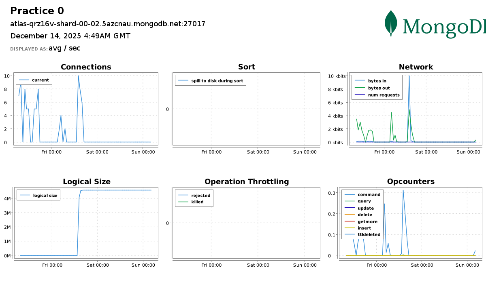
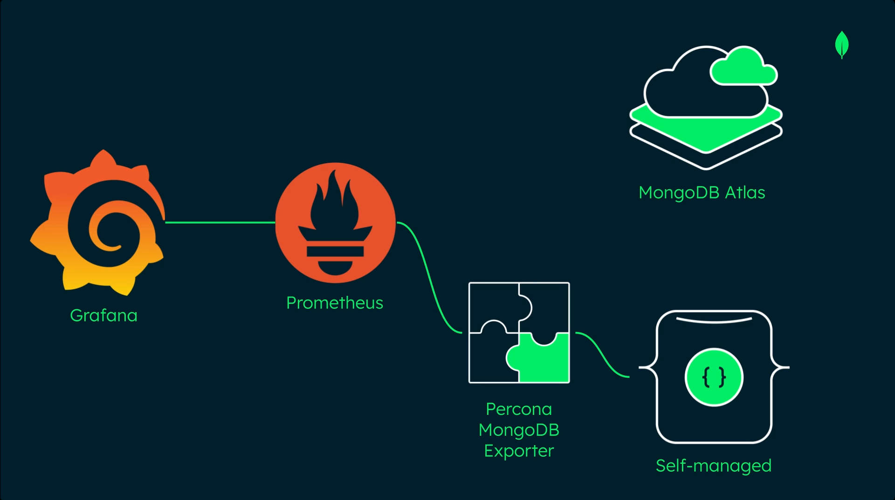

# MongoDB Atlas Atlas Foundations and Security

For the latest and most updated docs, visit: https://www.mongodb.com/docs/

## 1. Setup Atlas CLI
Installing Atlas CLI may also install `mongosh`, so this step might be unnecessary. <br>
Adding the following yum repo might still be useful if you have intension to install **MongoDB Community Server**.<br> 

Create a `/etc/yum.repos.d/mongodb-org-8.2.repo` file with contents as:
```ini
[mongodb-org-8.2]
name=MongoDB Repository
baseurl=https://repo.mongodb.org/yum/redhat/8/mongodb-org/8.2/$basearch/
gpgcheck=1
enabled=1
gpgkey=https://www.mongodb.org/static/pgp/server-8.0.asc
```
Then install the latest stable version of `mongosh` as:
```bash
sudo yum install -y mongodb-mongosh
mongosh --version
```
Atlas CLI is a cli tool to interface with MongoDB Atlas; while `mongosh` is used for interacting with MongoDB Database.<br>
Install Atlas CLI in linux (Fedora in my case):
```bash
dnf install mongodb-atlas -y
atlas --version
```

## 2. Getting Started with Atlas CLI

### 1. To authenticate Atlas CLI with MongoDB Atlas account
```
atlas auth login
```
A one-time verification code is generated that can be pasted in the browser prompt to authenticate our account with the CLI. <br>

A default profile is created after authentication, which can be read using:
```
atlas config describe default
```

### 2. Create a Local environment for SDLC
To create a local development environment, we need to ensure Podman/Docker is up and running.
```bash
systemctl status podman.socket
podman --version
```
Then deploy a new local deployment, **Dev**. We can initialize and populate the database with script inside `my-films-app/initdb-dev/loadFilms.js`:
```
atlas deployments setup Dev --initdb my-films-app/initdb-dev
```
**NOTE:** In my case, there was a bug that led to inability to parse my local timezone UTC+05:45 so I had to run:
```
TZ=UTC atlas deployments setup Dev --initdb my-films-app/initdb-dev
```
#### 1. Configuring Dev Dpeloyment  
Choose local (Local Database) option and choose the default configuration. Now connect to the deployment with mongosh. Inside the mongosh, run: 
```
show dbs
```
And we will see our local database, my-films-db. Run the following command to choose that database and read all the inserted documents :
```js
use my-films-db

db.films.find()
```
To run additional scripts after the deployment, run this inside mongosh:
```
load ("<script_name>")
```
#### 2. Import a database
To import an existing databse `datasets/listingsAndReviews.json` run:
```bash
mongoimport \
  --uri "mongodb://127.0.0.1:36985" \
  --db sample_airbnb \
  --collection listingsAndReviews \
  --file datasets/listingsAndReviews.json \
  --type json
```
Find out on what local port is the container's port exposed and update the port accordingly. You can run `podman ps -a` to find it out.

#### 3. Run mongosh without interactive shell
To execute MongoDB JS expressions directly from our command line without entering the interactive shell environment, we can make use of `mongosh --eval`:
```
mongosh "mongodb://localhost:27017" --quiet --eval "show dbs"
```

### 3. Create a Cloud cluster using AWS/Azure/GCP for Testing
We will create a M0 cluster (free tiered) with AWS as Cloud Provider.
```bash
atlas deployments setup Test --type ATLAS --provider AWS --region AP-SOUTH-1 --mdbVersion 8.0 --tier M0 --skipSampleData
```
This creates a M0 cluster in Mumabi region of AWS with MongoDB version 8.0 with no sample data preloaded. Remember the Username and Password and keep it safe. Now to list all the deployments (local and cloud):
```
atlas deployments list
```
To connect to a deployment, run:
```
atlas deployment connect Test
```
You will be prompted to enter the Username and Password to create a connection.

### 4. Create a custom profile for automation 
We can generate a custom profile with a scoped RBAC (Role Based Access Control) with `APIKeys` as mode of authentication (since `UserAccount` authenticated session with one-time verification code expires in 12 hours). <br>
So, lets generate a set of public/private API key pairs with `GROUP_OWNER` role, for the custom profile (for example, automation):
```
atlas projects apiKeys create --role GROUP_OWNER --desc "API Key for automation"
```
Copy the public and private keys and run:
```
atlas config init --profile automation
```
Select `APIKeys` as authentication type and paste the keys when prompted. <br>

**NOTE:** Since my home WiFi network is behind a ISP's CGNAT (Carrier Grade NAT), my public IP address may change dynamically. And, Atlas doesn't support IPv6 yet.
So disable `Require IP Access List for the Atlas Administration API` toggle on Organizations Setting in [MongoDB Cloud](https://cloud.mongodb.com/) to prevent any security issues when setting up the profile, like unable to identify Organizations and Projects under the user account. <br> If it doesn't work, just add **0.0.0.0/0** (quad-zero) to the IP Access List in the Security Quickstarts. 

## 3. Security
Here is a brief overview of differences between Atlas Users and Database Users. The roles might have been updated but the cores differences remain the same.


In short, Database Users are separate from Atlas Users, because Database Users have access to MongoDB databases, while Atlas Users have access to the Atlas application itself.

### 1. Atlas User Management using CLI
1. To view the organizations in a plaintext, run:
    ```
    atlas organizations list --output plaintext
    ```
2. To invite the MongoDB user with the email user@example.com to the organization with ORG_OWNER access: we run:
    ```bash
    atlas organizations invitations invite user@example.com --orgId <Organization-ID> --role ORG_OWNER --output json
    ```
3. To retrieve the projects for a specific organization, we can run:
    ```
    atlas projects list --orgId <Organization-ID> --output plaintext
    ```
4. To invite the MongoDB user with the email user@example.com to the project with GROUP_READ_ONLY access, we can run:
    ```bash
    atlas projects invitations invite user@example.com --projectId <projectId> --role GROUP_READ_ONLY --output json
    ```
5. To list all the users in a project, run:
    ```
    atlas projects users list --projectId <projectId>
    ```
6. To delete a specific user from a project, we run:
    ```
    atlas projects delete <ID> --projectId <projectId>
    ```
### 2. Database User Management using CLI
MongoDB supports following authentication methods for Database Users:
- SCRAM (default)
- X.509
- Kerberos
- OIDC
- AWS IAM
- LDAP <br>

Unlike Atlas Users, we can also create temporary Database Users (like, for contractors) that expire in 6 hours, 1 day, or 1 week.

1. To add a Database User with a Built-In Role (e.g. AtlasAdmin role):
    ```bash
    atlas dbusers create atlasAdmin --username dba --password dba-pass --deleteAfter 2026-01-14  --projectId <projectId>
    ```
2. To add an IP Address to the Access List:
    ```bash
    atlas accessList create <ip> --type ipAddress --projectId <projectId>
    ```
3. To update a Database User’s Role (e.g. to ReadWriteAnyDatabase role):
    ```bash
    atlas dbusers update dba --role readWriteAnyDatabase --projectId <projectId>
    ```
4. To delete a User from an organization:
    ```bash
    atlas dbusers delete dba --projectId <projectId>
    ```
5. To remove an IP Address from the Access List:
    ```bash
    atlas accessList delete <ip> --projectId <projectId>
    ```

### 3. Atlas Security Auditing

#### 1. Audit Logs
Audit Logs in Atlas track all system events on M10+ clusters, including the actions of a database user. Database auditing is not available for free-tiered M0 clusters. Atlas charges a 10% uplift in the hourly cost of all dedicated clusters for projects using this feature. Logs can be exported to AWS S3 bucktes, but they incur data egress charges.<br>

Audit logs track events such as client metadata, index creation and deletion, creation and removal of collections, and failed authentication.

To configure audit logs, you either need:
- Organizational Owner Role
- Project Owner Role for the project you want to update

1. To get server host names, we run:
    ```
    atlas process list --output plaintext
    ```
2. Now to download the logs with log name: *mongodb.gz* and host: *atlas-qrz16v-shard-00-00.5azcnau.mongodb.net:27017* :
    ```bash
    atlas logs download atlas-qrz16v-shard-00-00.5azcnau.mongodb.net:27017 mongodb.gz --projectId <projectId>
    ```
**NOTE:** Atlas Audit Logs don't track user creation or modification events as these operations are directly perfomed inside Admin Database.<br>
For full audit of system, we need a combination of: 
- Audit Logs
- mongodb.log
- Atlas Activity Feed

#### 2. Activity Feed
In Atlas, there are two types of Activity Feeds:
- **Organization Acitivity Feed**: Overview on selected events such as billing, access events, alert configurations.
- **Project Activity Feed**: Granular details on state of clusters and databases, networking events, Atlas/Database user lifecycle updates.

1. To access the Organization Activity Feed:
    ```
    atlas events organizations list --orgId <organizationId> --output plaintext
    ```
2. To access the Project Activity Feed for last 5 logs:
    ```
    atlas events projects list --projectId <projectId> --output plaintext | tail -n 5
    ```
**NOTE:** Unlike Audit Log, Activity Feed is available to all tiers of Atlas clusters. <br>

### 4. Encryption in Atlas
Three categories of Encryption:
- **Transport Encryption** (Network Encryption) using *TLS* and Certificate Authority: *Let's Encrypt*
- **Encryption at Rest** using *WiredTiger Encrypted Storage Engine*, and external KMS such as *AWS KMS*, *Azure Key Vault*, *Google Cloud KMS* 
- **In-use Encryption** (after loaded into memory) using *CSFLE* 

#### CSFLE (Client-Side Field Level Encryption):
In MongoDB Atlas, individual fields of highly sensitive data, within a document, can be encrypted using CSFLE, making it tamper- and read-proof on the server.
1. **Server Side:** Data is encrypted in client before sent to Database. Data is kept encrypted on Server once loaded into memory.
2. **Client Side:** Data and queries are encrypted/decrypted on client only. Encryption keys managed by external KMS; server doesn't have access to neither Encyption keys nor to unencrypted data.

## 4. Replication


### 1. Replica Set
A MongoDB replica set has following features:
- Commonly consists of 3, 5, or 7 **mongod** instances.
- Can have max of 50 members, with a max of 7 *voting members*.
- mongod instances run on servers (nodes).
- Has a primary and multiple secondaries.

#### Replica Set Members
- Only the Primary member receives *Write* Operations and keeps a rolling records of all the operations in **Oplog**.
- By default, only the Primary handles all *Read* operations but that can be changed.
- Secondary member replicates the contents of the Primary member by duplicating Primary's *oplog entries* and applying all the operations to their own datasets.

### 2. Automatic Failover and Election


If the Primary node goes down, **Election** is run to determine the new Primary for Replica Set. The secondary member with most votes from the *Voting Members* is chosen to be the new Primary. The unavailable Primary becomes new Secondary and uses Oplog to catch up.

Entire election process takes few seconds to complete. Election is triggered when:
- Adding new node to replica set.
- Initiating a replica set.
- Performing Replica set maintenance using: *rs.stepDown()* or *rs.reconfig()*
- If the secondaries lose connection to the Primary for more than configured timeout (default: 10 seconds)

The secondary that initiated the election shares how recent their data is as well as the election term (count tracking number of elections). It then proceeds to vote for itself.

#### Voting Memeber
- Each Voting Member can cast a single vote per election. 
- Maximum of 7 voting members. 
- Important to have **odd number** of voting member in a replica set.

#### Priority Value
- Default value of 1 for all members.
- We can assign values between 0 and 1000.
- Higher the value, more the eligibilty to become primary.
- Member with 0 ineligible to become primary and can't initiate election.

### 3. Operation Log (Oplog)
Oplog is a special collection called a **capped collection** that behaves like a *Ring Buffer*, as the oldest entries in Oplog are overwritten once it reches capacity. Each member in a replica set has its own oplog. <br>
**Note:** Each operation in *Oplog* (operation log) is idempotent.

Oplog is needed due to its usefulness such as:
- Recoveing to a specific timestamp in the oplog.
- Checking if secondaries are lagging behind the primary.
- Determining oplog window to avoid an initial sync when performing maintenance.

#### 1. Retrieve the Recent Oplog Entries
To retrieve the most recent entries in the oplog, first log into the Atlas cluster and switch to a database, e.g. `sample_database`. Insert multiple documents into it to populate the `oplog` collection with data:
```js
use sample_supplies

show collections                                                    # returns sales

db.sales.updateMany({}, {$inc: {"customer.satisfaction": 1}});
```
This command increases the value of the field **customer.satisfaction** by 1, for every documents inside the sales collection.  

Now switch to `local` db and examine its collections:
```js
use local

show collections
```
This shows `oplog.rs` as the collection inside local database.<br>
Query the namespace  `ns` followed by desired database and its colelction using dot notation.<br>
Sort by the natural descending order by using the `$natural` operator followed by -1. Optionally, you can sort by timestamp in descending order by using `{"ts":-1}` for more stability.<br>
Finally, limit the results to 5 by using `limit()` followed by 5.
```js
db.oplog.rs.find({"ns" : "sample_supplies.sales"}).sort({$natural: -1}).limit(5)
```

#### 2. Retrive Information about Oplog 
By default, the size taken by oplog is 5% of available diskspace with upper limit of 50GBs.
To confirm size of oplog, run:
```
rs.printReplicationInfo()
```
To retrive information about the secondaries’ oplog:
```
rs.printSecondaryReplicationInfo()
```
It gives information on `replLag` (Replication Lag) that informs about by how much time each of the secondaries is lagging behind the primary. If the replication lag is excessive in a secondary node, it enters into `RECOVERING` state. It is eligible to vote but can't accept Read operations. To bring recovering member up-to-date, it has to start initial sync.
`Initial sync` is an expensive process that copies all data, including the oplog from a replica set members.

### 4. Read and Write Concerns
Write Concern describes how many data-bearing members (i.e. the primary and secondaries, but not arbiters) need to acknowledge a write operation before it is deemed complete. A member can only acknowledge a write operation after it has received and applied the write successfully.<br>
MongoDB uses a `Write Concern of Majority` by default. But we can also use `Write Concern with a <number>` to represent number of members needed to acknowlege a write operation.<br>


Read Concern allow application to specify a durability guarantee for documents returned by Read operations. Can either choose to return most recent data to cluster or return data committed by majority of members.<br>

Read and Write Concerns can be combined to adjust a balance between consistency and availaibilty.

1. **For Write Concern**: Choosing `majority` prioritizes Consistency (Durability), as the system will become unavailable for writes if a majority of nodes cannot be reached (sacrificing Availability). Choosing `1` (Primary doesn't wait for replication to secondaries) prioritizes Availability/Low Latency, but at the risk of losing or rolling back data on a failover.

2. **For Read Concern**: Choosing `local` or `available` prioritizes Availability (Low Latency), as the query returns instantly with whatever data the selected node has. Choosing `majority` or `linearizable` prioritizes Consistency (Freshness), potentially leading to a higher-latency read while the database waits to confirm the data state.

#### 1. Specify the Write Concern on an Individual Operation
We insert a document into a `cats` collection, including a `options` document that specifies the write concern to **majority** and the write timeout to 3000 milliseconds:
```js
use pets

db.cats.insertOne({ name: "Mac", color: "black", age: 6 }, { writeConcern:
{ w: "majority" , wtimeout: 3000 } });
```
Write timeout ensures the operation waits for the specified number of acknowledgments, but if the time limit is reached first, the client will immediately return a `Write Concern Error`.

#### 2. Set the Default Read and Write Concerns for all users
We use `adminCommand()` to issue command to admin database that accepts a document as argument.<br> We set the `defaultReadConcern` level to "majority", which returns only data that has been acknowledged as written to a majority of members in a replica set.<br>
We set the `defaultWriteConcern` level to "majority" so that a majority of members must acknowledge the write operation.
```js
use admin

db.adminCommand({
    setDefaultRWConcern : 1,
    defaultReadConcern: { level : "majority" },
    defaultWriteConcern: { w: "majority" }
  })
```

#### 3. Read Preferences
Specifies which members of a replica set we want to send read operations to. 
Options available:
- primary: (default) all read operations go to primary member
- primaryPreferred: attempts to read from primary, but can go to secondary if unavailable
- secondary (chance to return stale data, so caution needed)
- secondaryPreferred
- nearest (directs all reads to members with nearest pings; for geographically local reads with low latency) <br>


To set the read preference for secondary with time limit for data staleness of 120 seconds, append it to the options in the connection string:
```
mongodb://db0.example.com,db1.example.com,db2.example.com/?replicaSet=myRepl&readPreference=secondary&maxStalenessSeconds=120
```

## 5. Deploying Replica Set in MongoDB Deployment
I am using my exising VM setup from the repository: https://github.com/biplavpoudel/BuildingLinuxServer for the Replica Sets and DNS configurations.

**NOTE:** I have added the configurations inside [replicaset-configs](https://github.com/biplavpoudel/MongoDB-Atlas-Administration/tree/main/replicaset-configs) folder in this repository.

### 1. Update DHCP Server
Inside our `dhcp1.example.com` DHCP Server, we need to update the `/etc/kea/kea-dhcp4.conf` to create a new subnet for our mongod instances:
```json
"subnet4": [

  {
    "id": 1,
    "subnet": "10.0.2.0/25",
    "pools": [ { "pool": "10.0.2.20-10.0.2.100" } ],
    "option-data": [
      { "name": "routers", "data": "10.0.2.1" },
      { "name": "domain-name-servers", "data": "10.0.2.5" },
      { "name": "domain-search", "data": "example.com" },
      { "name": "domain-name", "data": "example.com" }
    ]
  },
  {
    "id": 2,
    "subnet": "10.0.2.128/25",
    "pools": [ { "pool": "10.0.2.150-10.0.2.180" } ],
    "option-data": [
      { "name": "routers", "data": "10.0.2.1" },
      { "name": "domain-name-servers", "data": "10.0.2.5" },
      { "name": "domain-search", "data": "replset.com, example.com" },
      { "name": "domain-name", "data": "replset.com" }
    ]
  }
]

```

Test and restart kea-dhcp4:
```
kea-dhcp4 -t /etc/kea/kea-dhcp4.conf
systemctl restart kea-dhcp4
```

### 2. Update DNS Server

Lets head into `ns1.example.com` DNS Server, log in as root and edit the existing `/etc/bind/named.conf.local` to add a new DNZ zone: `replset.com`. Append new lines as:
```bash
cat <<EOF >> /etc/bind/named.conf.local
zone "replset.com"
    {
    type master;
    file "/etc/bind/zones/db.replset.com";
    };
EOF
```

Lets create a new Zone inside `/etc/bind/zones` as:
```
vim db.replset.com
```
and add the following record:
```vim
$TTL	1w
@	IN	SOA	ns1.example.com. admin.replset.com. (
			2025 		; Serial
			1w		; Refresh
			1d		; Retry
			28d		; Expire
			1w) 	; Negative Cache TTL
			 
; name servers - NS records
		IN	NS	ns1.example.com.

; name servers - A records
ns1.example.com.		IN	A	10.0.2.5

; 10.0.2.0/24 - A records
mongod0 IN      A       10.0.2.151       
mongod1 IN      A       10.0.2.152      
mongod2 IN      A       10.0.2.153
```

Update the reverse zone `db.2.0.10` with:
```bash
cat << EOF >> /etc/bind/zones/db.2.0.10

; --- New MongoDB Replica Set PTR Records ---
151     IN      PTR     mongod0.replset.com.
152     IN      PTR     mongod1.replset.com.
153     IN      PTR     mongod2.replset.com.
EOF
```
Validate zone files as:
```
named-checkzone replset.com /etc/bind/zones/db.replset.com
named-checkzone 2.0.10.in-addr.arpa /etc/bind/zones/db.2.0.10
```
Reload BIND9 service:
```bash
systemctl reload bind9
```

### 3. Create three Mongod Instances
I am creating three Debian 13 (trixie) based VMs in the subnet 10.0.2.128/25.

Install MongoDB on each instances by following the instructions in this [Installation Docs](https://www.mongodb.com/docs/manual/administration/install-community/?linux-distribution=debian&linux-package=default&operating-system=linux&search-linux=without-search-linux).

Edit the IP address to be static by going to `/etc/network/interface`. <br>
For `mongod0.replset.com`, modify as:
```
iface enp1s0 inet static
	address 10.0.2.151
	gateway 10.0.2.1
	dns-nameservers 10.0.2.5
	dns-search replset.com
```
Similary, set static IP of `10.0.2.152` and `10.0.2.153` for mongod1 and mongod2 respectively.<br>
Likewise, update the IP address and domain names in `/etc/hosts` for each VMs.<br>
e.g. For `mongod0` server:
```
127.0.0.1	localhost
10.0.2.151	mongod0.replset.com	mongod0
```

Likewise open firewall port: tcp/27017 in firewall-cmd as:
```bash
firewall-cmd --permanent --add-rich-rule='
    rule family="ipv4"
    source address="10.0.2.128/25"
    port protocol="tcp" 
    port="27017" accept'
```

### 4. Keyfile Authentication for internal cluster authentication

MongoDB supports exactly two mechanisms for internal member authentication:
- Keyfile authentication (symmetric, shared secret)
- X.509 certificate authentication (asymmetric, PKI-based)

We are opting for `Keyfile` authentication, for this testing lab, to avoid the hassle and operational pain that comes with X.509 certificates. With keyfile authentication, each mongod instances in the replica set uses the contents of the keyfile as the shared password for authenticating other members in the deployment. Only mongod instances with the correct keyfile can join the replica set.

#### 1. Generate the keyfile
Lets pick `mongod0` and generate the shared key:
```bash
sudo mkdir -p /etc/mongodb/pki
sudo openssl rand -base64 756 | sudo tee /etc/mongodb/pki/keyfile
```
#### 2. Set permissions and ownership
Set the owner to be `mongodb` (system user running `mongod`) and permission to be 400.
```bash
sudo chown mongodb:mongodb /etc/mongodb/pki/keyfile
sudo chmod 400 /etc/mongodb/pki/keyfile
```
#### 3. Copy the key to other VMs
We use scp (secure copy) to replicate the keyfile in `etc/mongodb/pki/keyfile` of remaining two VMs:
```bash
scp /etc/mongodb/pki/keyfile root@10.0.2.152:/tmp/
scp /etc/mongodb/pki/keyfile root@10.0.2.153:/tmp/
```
Then, in each of the two remaining VMs, `mongod1` and `mongod2` we repeat the process:
```bash
sudo mv /tmp/keyfile /etc/mongodb/pki/
sudo chown mongodb:mongodb /etc/mongodb/pki/keyfile
sudo chmod 400 /etc/mongodb/pki/keyfile
```
### 5. Update `mongod.conf` on all three Replica Set members
We now update the configuration file for for `mongod` process in all three VMs for replication, security and network interfaces.

Lets vim into `/etc/mongod.conf` and edit the file as:
```yaml
security:
 keyFile: /etc/mongodb/pki/keyfile
 authorization: enabled  

replication:
 replSetName: mongodb-repl-dev

net:
 port: 27017
 bindIp: 127.0.0.1, mongod0.replset.com
```

Replicate the update in other two VMs and update `net.bindIp` field accordingly. <br>

**WARN**: Use spaces not tabs, as YAML explicitly needs spaces. Also, the reason we use fqdn in `net.bindIp` is because according to official documentation: *Starting in MongoDB 5.0, nodes that are only configured with an IP address fail startup validation and do not start.*

Now, restart MongoDB for changes to take effect and ensure `mongod` daemon is listening in correct IP:
```bash
sudo systemctl restart mongod
ss -tulpn | grep 27017
```
Correct output for `mongod0` looks like:


### 6. Initiate the Replica Set
Connect on Server1, **mongod0**, by using the `mongosh` command and switch to the `admin` database.<br> Use `rs.initiate()` with a document that contains the replica set as the `_id` and the hosts’ names. 
```js
use admin

rs.initiate(
  {
     _id: "mongodb-repl-dev",
     version: 1,
     members: [
        { _id: 0, host : "mongod0.replset.com" },
        { _id: 1, host : "mongod1.replset.com" },
        { _id: 2, host : "mongod2.replset.com" }
     ]
  }
)
```

### 7. Create Admin User
Execute `mongosh` on each VM, one of the VM becomes primary and rest becomes secondary. Since each VM has `priority:1`, the election is random.

In my case, `mongod2` was the **primary member**, so inside it I created an admin user with `root` role that’s able to authenticate to the replica set.
```js
db.createUser({
   user: "dba-admin",
   pwd: "dba-pass",
   roles: [
     {role: "root", db: "admin"}
   ]
 })
```

### 8. Login as Admin User
Exit `mongosh` and then log back in to the replica set, `mongod2` as: 
```bash
mongosh --host mongod2.replset.com -u dba-admin -p dba-pass --authenticationDatabase admin
```
### 9. Change Priority of Members
Now, inside the `mongosh`, to change the priority level of `mongod0` to be be higher than others in a running replica set, we execute `rs.conf()`. We assign the `rs.conf()` command to a variable to retrieve the replica set configuration object and assign priority value for each member:
```js
use admin

rs.conf()

cfg = rs.conf()
cfg.members[0].priority = 2  
cfg.members[1].priority = 1
cfg.members[2].priority = 1    

rs.reconfig(cfg)
```
### 10. Initiate an Election
To initiate an election, we use the rs.stepDown() command: 
```
rs.stepDown()

quit
```
Now `mongod0` is elected to be the primary member of the `mongodb-repl-dev` replica set.
Log in to the mongosh as admin user using:
```bash
mongosh --host mongod0.replset.com -u dba-admin -p dba-pass --authenticationDatabase admin
```

## 6. Reconfigure Replica Set in MongoDB Deployment
### 1. Retrieve the Status of a mongod Instance
We use the `db.hello()` command to retrieve information about the instance of the replica set, including lightweight information about:
- Host of each member
- Name of the replica set
- Name of the primary
- Election id
- Timestamps for when the last operation occurred and when it became durable

.png)

### 2. Add a Member to a Replica Set
To add a new member to a replica set, define the new member’s `_id` and `host name` in an object. Then, push this new member to the members array in the configuration object and run `rs.reconfig()` with `config` variable asargument to apply changes:
```
member = {"_id": 3, "host": "mongod3.replset.com:27017"}

config.members.push(member)

rs.reconfig(config)
```
Alternatively, it is easier to just use the `rs.add()` wrapper followed by the host to add a member to the replica set:
```
rs.add("mongod3.replset.com:27017")
```

### 3. Remove a Member from a Replica Set
To remove a member from a replica set, we can use the JavaScript `splice()` method. Pass in as arguments the index of the starting member and the number of elements being removed:
```
config.members.splice(3, 1)

rs.reconfig(config)
```

Or, just use use the `rs.remove()` wrapper followed by the host to remove a member from the replica set: 
```
rs.remove("mongod3.replset.com:27017")
```

### 4. List all members:
To list all members in the updated replica set, we run:
```
rs.conf().members
```
### 5. Retrieve the Status of a Replica Set
We use `rs.status()` command (wrapper for `replSetGetStatus`) to retrieve the current status of a replica set, such as:
- Health of each member
- Check if a member is the primary or a secondary
- Information about operations

`rs.status()` provides detailed information about all members of the replica set, their current states (PRIMARY, SECONDARY, STARTUP2, RECOVERING, etc.), hostnames, replication lag (optime), and overall health.<br> Meanwhile, `db.hello()` seems more like the subset of the full status and only provides an immediate state information needed for clients to route operations correctly.

# Atlas Administration
## 1. MongoDB Atlas Administration
### 1. Cluster Status and Health

We had setup a profile `automation` with Organization scoped to `MongoDB Atlas Learn` and Project scoped to `Practice 0`.
To list our active profiles, run in `/bin/bash` shell:
```
atlas config list
```
This returns: `
[
       "automation"
]`

To describe the profile to ensure the correct `org_id` and `project_id` is set:
```
atlas config describe automation
```

#### 1. List Processes
Ensure everything is correct and run the following command to return all running processes for our Atlas project:
```
atlas process list -o plaintext
```
this returns the Cluster Ids and Replica Set Name:
```
ID                                                   REPLICA SET NAME       SHARD NAME   VERSION
atlas-qrz16v-shard-00-00.5azcnau.mongodb.net:27017   atlas-qrz16v-shard-0   <nil>        8.0.16
atlas-qrz16v-shard-00-01.5azcnau.mongodb.net:27017   atlas-qrz16v-shard-0   <nil>        8.0.16
atlas-qrz16v-shard-00-02.5azcnau.mongodb.net:27017   atlas-qrz16v-shard-0   <nil>        8.0.16
```

#### 2. Retrieve Process Metric
In Atlas UI, https://cloud.mongodb.com, we can head over to `Cluster Metrics` and look at the status of primary cluster node,`atlas-qrz16v-shard-00-00.5azcnau.mongodb.net:27017`, for our project `Practice0`, as:



Using atlas cli, we can retrieve metrics for the same cluster node with Period of `3PD` (3 Days), Metrics type `CONNECTIONS` and Granularity of `1PD` (1 Day) as:
```bash
atlas metrics processes atlas-qrz16v-shard-00-00.5azcnau.mongodb.net:27017 --granularity P1D --period P3D --type CONNECTIONS --output plaintext 
``` 
which returns:
```
NAME          UNITS    TIMESTAMP                             VALUE    
CONNECTIONS   SCALAR   2025-12-11 18:17:18 +0000 UTC         3        
CONNECTIONS   SCALAR   2025-12-12 18:17:27 +0000 UTC         0        
CONNECTIONS   SCALAR   2025-12-13 18:17:27 +0000 UTC         0
```
### 2. User and Database Management
Atlas Users have access to Atlas application, while Databse users have access to MongoDB databases.<br>
For Database users, MongoDB provides built-in RBAC rules to control which users can perform read and write operations on a database:
- Atlas Admin
- readAnyDatabase
- readWriteAnyDatabase
We can go more granular with `Special Privileges` and `Custom Roles`. We can also create a `Temporary User` with a duration of 6 hours, 1 day, or 1 week.<br><br>


To create a new database user, `test-user-1`, with `readWrite` role on the `accounts` collection in the `sample_analytics` database , we run following command in `/bin/bash` :

```bash
atlas dbusers create --username test-user-1 --password test-password --role readWrite@sample_analytics.accounts
```
The syntax to specify a privilege on a database and a collection is:`--role <privilege>@<database>.<collection>`

### 3. Logging Basics
MongoDB maintains running logs of events such as: incoming connections, commands run and, issues encountered.

**NOTE:** Free and shared clusters doesn't provide downloadable logs.

An example of the Atlas CLI command to download logs on a Dedicated M10+ Cluster is:
```bash
atlas logs download security-shard-00-00-xwgj1.mongodb.net mongos.gz --start "1678808429" --end "1678808487"
```

## 2. MongoDB Logging Basics
### 1. MongoDB Logs in Atlas
To download logs, we require the `Project Data Access Read Only` role or greater in MongoDB Atlas. To determine if our Atlas user has this role, run the following command in the Atlas CLI:
```
atlas project users list -o json
```
The equivalent of `Project Data Access Read Only` role in Atlas API is `GROUP_DATA_ACCESS_READ_ONLY`.

To download the `mongod` log file for past 30 days, we run:
```bash
atlas logs download uml3-shard-00-00.xwgj1.mongodb.net mongodb.log.gz

gunzip mongodb.log.gz
```
### 2. MongoDB Logs on Self-Managed Instances
For this lab, I am not going to use the Replica Sets VMs because I already have a local Atlas deployment named `Dev` in my Linux host.<br> We can list all containers and if present, start our `docker.io/mongodb/mongodb-atlas-local:8` container:
```
podman ps -a

podman start Dev
```
#### 1. Start Bash shell inside the Container
Instead of running `mongosh` using:
```bash
podman exec -it Dev mongosh "mongodb://127.0.0.1:27017"
```
we are going to run a `/bin/bash` shell inside the Dev container:
```bash
podman exec -it Dev /bin/bash
```
#### 2. Check Default Location for the Log File
Now, we are going to check the log location in `/etc/mongod.conf`:
```bash
cat /etc/mongod.conf | grep path
```
This command returns the default path for log: `/var/log/mongodb/mongod.log`

#### 3. Check Permissions of the Server Log File and Access it
Check the file permissions for `/var/log/mongodb/mongod.log` using `ls -l` command:
```
ls -l /var/log/mongodb/mongod.log
```
Ensure the user `mongod` has Read/Write permission for the file. Now to read the top 5 lines, we run:
```
head -5 /var/log/mongodb/mongod.log
```

#### 4. Capture logs from Container's output stream
Since containers are meant to be ephemeral in nature, the server logs are probably not written in `mongod.log`, even if all the file permissions are good and the path is valid.<br> We can capture the logs written to **stdout/stderr** stream by running the following command in our host Linux `/bin/bash` shell:
```
podman logs Dev
```

#### 5. Retrive Log Messages in mongosh
To retrieve recent global log messages from the RAM cache in `mongosh`, we can use the `show log ` helper and provide it with one of the available filters, such as `global` or `startupWarnings`.
```
show log <type>
```
To view the available filters that can be provided to the show log helper, use the following helper command in mongosh:
```
show logs
```
#### 6. View local Atlas deployment logs with the Atlas CLI
MongoDB also provides a specific CLI command to retrieve logs for local deployments:
```
atlas deployment logs --deploymentName Dev
```
----

**NOTE**: 
1. Client Log path (i.e. `mongosh`), unlike server logs (`mongod`), can be find out by running the follwing command inside `mongosh`:
    ```
    log.getPath()
    ```
    In my case, it was `/home/mongod/.mongodb/mongosh/693e776c7a9ee6f4dc8de665_log`.

2. The mongosh helper `show log global` internally calls the `getLog` command to return recent log messages from the RAM cache:
    ```js
    db.adminCommand( { getLog:'global'} )
    ```

### 3. MongoDB Log Events

#### 1. Sample Log Entry
A sample JSON log entry from a mongod instance shows a client connection:
```json
{
  "t": {
    "$date": "2020-05-20T19:18:40.604+00:00"
  },
  "s": "I",
  "c": "NETWORK",
  "id": 51800,
  "ctx": "conn281",
  "svc": "R",
  "msg": "client metadata",
  "attr": {
    "remote": "192.168.14.15:37666",
    "client": "conn281",
    "doc": {
      "application": {
        "name": "MongoDB Shell"
      },
      "driver": {
        "name": "MongoDB Internal Client",
        "version": "4.4.0"
      },
      "os": {
        "type": "Linux",
        "name": "CentOS Linux release 8.0.1905 (Core) ",
        "architecture": "x86_64",
        "version": "Kernel 4.18.0-80.11.2.el8_0.x86_64"
      }
    }
  }
}
```

#### 2. Field Descriptions

| Field Name | Type | Description |
| :--- | :--- | :--- |
| **t** | *Datetime* | Timestamp of the log message in ISO-8601 format. |
| **s** | *String* | Short severity code of the log message.|
| **c** | *String* | Full component string for the log message.|
| **id** | *Integer* | Unique identifier for the log statement.|
| **ctx** | *String* | Name of the thread that caused the log statement. |
| **svc** | *String* | Name of the service in whose context the log statement was made. Will be `S` for "shard", `R` "router", or `-` for "unknown" or "none". |
| **msg** | *String* | Log output message passed from the server or driver. If necessary, the message is escaped according to the JSON specification. |
| **attr** | *Object* | One or more key-value pairs for additional log attributes. If a log message does not include any additional attributes, the `attr` object is omitted. Attribute values may be referenced by their key name in the `msg` message body, depending on the message. If necessary, the attributes are escaped according to the JSON specification. |
| **tags** | *Array of strings* | Strings representing any tags applicable to the log statement. For example, **["startupWarnings"]**. We can view all the messages with a tag of *startupWarnings* by running `show log startupWarnings` inside mongosh.|
| **truncated** | *Object* | Information about the log message truncation, if applicable. Only included if the log entry contains at least one truncated `attr` attribute. |
| **size** | *Object* | Original size of a log entry if it has been truncated. Only included if the log entry contains at least one truncated `attr` attribute. |

#### 3. Field Types (Severity)
`Severity` ranges from `Fatal` (most severe) to `Debug` (least severe).

| Level | Description | Detail |
| :--- | :--- | :--- |
| **F** | Fatal | A critical, terminating event. |
| **E** | Error | A serious problem.    |
| **W** | Warning | A potential issue that is not immediately critical. |
| **I** | Informational | General information, used when verbosity level is 0. |
| **D1** - **D5** | Debug | Detailed logging, used for verbosity levels > 0. The number (D1, D2, etc.) indicates the specific debug verbosity level. |

#### 4. Field Types (Component)
Likewise, `Component` field type indicates the category a logged event is a member of, such as **NETWORK** or **COMMAND**. We can specify the verbosity level of various components to determine the amount of Informational and Debug messages MongoDB outputs. Some of the available components are:
- **ACCESS**: Messages related to access control, such as authentication. 
- **ASSERT**: An assertion is triggered when an operation returns an error.
- **COMMAND**: Messages related to database commands, such as count.
- **CONTROL**: Messages related to control activities, such as initialization.
- **ELECTION**: Messages related specifically to replica set elections.
- **REPL**: Messages related to replica sets, such as initial sync, heartbeats, steady state replication, and rollback. Parent component of `ELECTION`.
- **NETWORK**: Messages related to network activities, such as accepting connections. <br>

and many more.

### 4. MongoDB Server Log Customizations

#### 1. Set a slowms Threshold
`mongod.log` is also called **Diagnostic Logs**. To include slow queries in the diagnostic logs, we need to configure a property called **slowms**, which defines the max amount of time for an operation to complete before it is deemed slow. Any operations above this threhold is written to the diagnostic logs.

The default value for **slowms** threshold is *100 milliseconds*. To set a custom threshold, we can do one of three things:
1. Use **--slowms** launch parameter to MongoDB service.
2. Use `db.setProfilingLevel()` in mongosh.
3. Add **slowOpsThreshold** property in configuration file.


To set a slowms threshold for an M10-or-above Atlas cluster or a self-managed MongoDB deployment, we use the `db.setProfilingLevel()` method in mongosh. This method accepts two parameters: **the profiler level** and **an options object**.

The profiler level is set to `0` to *disable profiling completely*, set to `1` for *profiling operations that take longer than the threshold*, and set to `2` for *profiling all* operations.

To leave the profile disabled but changes the slowms threshold to 30 milliseconds:
```js
db.setProfilingLevel(0, { slowms: 30 })
```

#### 2. Find Slow Operations in a Log
I will first import a `sample_airbnb` datbase into the mongod container with the command:
```bash
mongoimport \
  --uri "mongodb://127.0.0.1:36985" \
  --db sample_airbnb \
  --collection listingsAndReviews \
  --file datasets/listingsAndReviews.json \
  --type json
```
Now we execute following command to find all documents, sorted by the number of listings, without an index, as index-less query is always slow:
```js
use sample_airbnb

db.listingsAndReviews.findOne({ "host.host_id": '1282196'})

db.listingsAndReviews.find({}).sort( {"host.host_total_listings_count":-1})
```

To find log messages related to slow operations, we use the `grep` command to find instances of the phrase `“Slow query”`, and then pipe the result into jq, a utility for processing and pretty-printing JSON:
```bash
grep "Slow query" /var/log/mongodb/mongod.log | jq
```
Alternatively, we can run Atlas CLI to get deplyment logs:
```bash
atlas deployment logs --deploymentName Dev -o jsonpath | grep "Slow query" | jq
```

#### 3. Verbosity Levels and Viewing Current Log Verbosity Level
We can specify the **logging verbosity level** to increase or decrease the amount of log messages MongoDB outputs. Verbosity levels can be adjusted for all components together, or for specific named components individually.

Verbosity affects log entries in the severity categories **Informational and Debug only**. Severity categories above these levels are *always shown*. <br>
We set verbosity levels to a *high value* to show detailed logging for debugging or development, or to a *low value* to minimize writes to the log on a vetted production deployment.

To view the current verbosity levels, we use the `db.getLogComponents()` method:
```
db.getLogComponents()
```
The output resembles similar to:
```json
{
 "verbosity" : 0,
 "accessControl" : {
    "verbosity" : -1
 },
 "command" : {
    "verbosity" : -1
 },
 ...
 "storage" : {
    "verbosity" : -1,
    "recovery" : {
       "verbosity" : -1
    },
    "journal" : {
        "verbosity" : -1
    }
 },
 ...
}
```
The **initial** verbosity entry is the **parent verbosity** level for all components,while the individual named components that follow, such as `accessControl`, indicate the specific verbosity level for that component, overriding the global verbosity level for that particular component if set.

A value of **-1**, indicates that the component **inherits the verbosity level** of their parent, if they have one (as with recovery above, inheriting from storage), or the global verbosity level if they do not (as with command).

#### 4. Configure Log Verbosity Levels
You can configure the verbosity level using:
##### 1. `systemLog.verbosity` settings
  To configure the default log level for all components, we use the **systemLog.verbosity** setting. To configure the level of specific components, use the **systemLog.component.*name*.verbosity** settings in `/etc/mongodb.conf`.
  
```yaml
systemLog:
  verbosity: 1
  component:
    query:
      verbosity: 2
    storage:
      verbosity: 2
      journal:
        verbosity: 1
```
##### 2. `logComponentVerbosity` Parameter
To set the **logComponentVerbosity** parameter, we pass a document with the verbosity settings to change in `db.adminCommand()`
```js
db.adminCommand({
  setParameter: 1,
  logComponentVerbosity: {
    verbosity: 1,
    query: {
       verbosity: 2
    },
    storage: {
       verbosity: 2,
       journal: {
          verbosity: 1
       }
    }
  }
})
```
##### 3. `db.setLogLevel()` command for self-managed deployment
We can use the `db.setLogLevel()` method to update a single component log level in `mongosh` for self-managed deployments. 
```bash
db.setLogLevel(-1, "query")
```
Or, simply run from the `/bin/bash` shell using the `--eval` parameter, which allows us to immediately pass commands to mongosh without entering the shell and `--quiet` option which reduces noise in the output:
```bash
mongosh "mongodb://localhost:36985" --quiet --eval "db.setLogLevel(-1, "query")"
```

### 5. MongoDB Server Log Rotation and Retention
In MongoDB M10+ Atlas Cluster, logs messages and system event audit messages are retained for 30 days for each node in a cluster. To view and download logs in Atlas, the user must have at least `Project Data Access Read Only` role. <br> In contrast, for self-managed deployments, log files are retained indefinitely unless explicitly told to rotate logs. 

#### 1. Rotating Logs in self-managed deployment
To rotate logs for a self-managed `mongod` deployment, we can use the `db.adminCommand()` in mongosh:
```js
db.adminCommand( { logRotate : 1 } )
```
Alternatively, we can issue the `SIGUSR1` signal to the `mongod` process with the following command:
```
sudo kill -SIGUSR1 $(pidof mongod)
```

#### 2. Rotating Logs Using rename and reopen rotation behaviour

By default, MongoDB uses the `--logRotate rename` behavior. With `rename` behavior, `mongod` responds to **logRotate** command or **SIGUSER1** signal and renames the current log file by appending a UTC timestamp to the filename, opens a new log file, closes the old log file, and sends all new log entries to the new log file.

To start mongod with MongoDB’s standard **rename** log rotation behavior, we need to invoke the daemon with the `--logpath` argument. Even though rename is not explicitly specified, it’s the default if the `--logpath` argument is used:
```
mongod -v --logpath /var/log/mongodb/server1.log
```
Similarly, log rotation with `--logRotate` reopen closes and opens the log file following the typical Linux/Unix log rotate behavior. To start the mongod process with the **reopen** approach, we invoke the `mongod` daemon with the following cli arguments:
- `--logpath` sends all diagnostic logging information to a log file
- `--logappend` appends new entries to the end of the existing log file
- `--logRotate` determines the behavior for the logRotate command (rename or reopen)

```
mongod -v --logpath /var/log/mongodb/server1.log --logRotate reopen --logappend
```

#### 3. Automating Log Rotation with the logrotate Service

`logrotate` is a Linux utility designed to ease administration of systems that generate large numbers of log files. It allows automatic rotation, compression, removal, and mailing of log files. Each log file can be handled daily, weekly, monthly, or when it grows too large.

To automate the rotation of MongoDB logs by using the Linux `logrotate` service, first we make the following changes to the `mongod.conf` file with `systemLog.logRoatate` set to **reopen**:
```
systemLog:
  destination: file
  logAppend: true
  path: /var/log/mongodb/mongod.log
  logRotate: reopen
```

To leverage the **logrotate** service in Linux, we need to create a script that provides instructions to rotate logs, located in the `/etc/logrotate.d` directory for the service:
```
sudo vim /etc/logrotate.d/mongod.conf
```
To configure **logrotate** to send a **SIGUSR1** signal to mongod once per day, or when the file size reaches 10 MB, we use the following configuration:

```bash
/var/log/mongodb/mongod.log {
   daily 
   size 
   rotate 10 
   missingok
   compress 
   compresscmd /usr/bin/bzip2 
   uncompresscmd /usr/bin/bunzip2 # command to uncompress the file
   compressoptions -9 # options for the compression utility
   compressext .bz2 # file format of the compressed archive
   delaycompress # wait to compress files until it's an opportune time
   notifempty # don't bother compressing if the log file is empty
   create 640 mongodb mongodb # creates the log  file with specific permissions
   sharedscripts # don't run multiple rotations at once
   postrotate # tell mongod to rotate, remove empty files
       /bin/kill -SIGUSR1 `cat /var/run/mongodb/mongod.pid 2>/dev/null` >/dev/null 2>&1
       find /var/log/mongodb -type f -size 0 -regextype posix-awk -regex "^\/var\/log\/mongodb\/mongod\.log\.[0-9]{4}-[0-9]{2}-[0-9]{2}T[0-9]{2}-[0-9]{2}-[0-9]{2}$" -execdir rm {} \; >/dev/null 2>&1
   endscript
}
```
We then restart the mongod service with: `systemctl restart mongod`.

**Note**: The MongoDB configuration file and the **logrotate** script have the same filename. The following file should be created in `/etc/logrotate.d/` and named `mongod.conf`.

#### 4. Testing the logrotate Configuration
To test the logrotate configuration, we issue a **SIGUSR1** signal to the mongod process while watching the log in real-time:
```bash
sudo tail -F /var/log/mongodb/mongod.log
```
Here, **-F** flag re-opens the log file, `mongod.log` by its name when it detects that it has been rotated. <br>

Then, we issue `SIGUSR1` signal in linux to the `mongod` process to rotate the logs as:
```bash
sudo kill -SIGUSR1 $(pidof mongod)
```
In `mongod.log`, we will notice something similar to the following line to indicate that the log was reopened:
```
tail: /var/log/mongodb/mongod.log: file truncated
```

## 3. MongoDB Database Metrics & Monitoring 

### 1. Core Metrics and Additional Metrics
MongoDB considers following metrics as `core metrics`:
- **Query Targeting** : measures read efficiency by analyzing ratio of document scanned to document returned by read operation. Ideal ratio is 1:1.
- **Storage**: monitor disk usage; key metrics are: Disk Space Percent Free, Disk IOPS, Disk Queue Health, Disk Latency.
- **CPU Utilization**: tracks CPU usage by deployment; includes System and Process CPU.
- **Memory Utilization**: system is sized to hold all indexes; key metrics are: System Memory and Swap Usage.
- **Replication Lag**: measures delay between primary and secondary; expressed in seconds.

<br>

Some `additional metrics` that might be needed in monitoring are:
- **Opcounters**: represents number of operations per second run on MongoDB process since last restart; tracks operations such as: command, query, insert, delete, update, getmore, ttldeleted.
- **Network**: network performance metrics such as bytesIn, bytesOut, numRequests.
- **Connections**: displays total number of active connections to the database cluster by Application, Shell Clients and Internal MongoDB Connections.
- **Tickets Available**: represents number of concurrent read and write operations available to `WiredTiger Storage Engine`; when available tickets drop to zero, other read/write requests operations must queue until tickets are available.

### 2. Monitoring M10+
To to return all running processes for our project:
```
atlas processes list
```
To retrieve `CONNECTIONS` metrics for a cluster node for a period of `1 Day` and granularity of `5 Minutes`:
```bash
atlas metrics processes <cluster id> --period P1D --granularity PT5M -o json –-type CONNECTIONS
```
### 3. Configuring Alerts in Atlas CLI
Atlas allows to configure different alerts at the Organization and Project Levels. We are focussing on Project Alerts. We **must** have `Project Owner` role to configure Project Alert settings.

**NOTE**: Alerts can be configured for any metric across all cluster tiers, however, **shared-tier clusters** will only trigger alerts related to the metrics supported by those clusters, including `Network`, `Connections`, `Logical Size`, and `Opcounters`.

#### 1. View our project’s current Alert Settings
```
atlas alerts settings list --output json
```
#### 2. Create a New Alert
To create a new alert configuration that notifies a user via email when a new user joins this project:
```bash
 atlas alerts settings create --event JOINED_GROUP --enabled \
 --notificationIntervalMin 5 \
 --notificationType USER \
 --notificationEmailEnabled \
 --notificationUsername biplavpoudel764@gmail.com \
 --output json --projectId <project id> 
```
#### 3. Update Alert Settings
To update an alert to notify a different user when a new user joins in:
```bash
 atlas alerts settings update <alert id> \
 --event JOINED_GROUP \
 --enabled \
 --notificationIntervalMin 5 \
 --notificationType USER \
 --notificationEmailEnabled \
 --notificationUsername biplavpoudel@outlook.com \
 --output json \
 --projectId <project id> 
```
#### 4. Delete an Alert
```
atlas alerts settings delete <alertConfigId> 
```

### 4. Responding to Alerts
When a condition triggers an alert, Atlas displays a warning symbol on the cluster and sends alert notifications. Our alert settings determine the notification methods. Atlas continues sending notifications at regular intervals until the alert is acknowledged.<br>
Atlas stops issuing further notifications until:
- the acknowledgement period ends,
- we resolve the alert condition or,
- we manually unacknowledge the alert.

If the alert condition ends during the acknowledgement period, Atlas sends a notification.

**NOTE:** A `Project Owner` cannot manually close an alert. Disabling an alert also will not mark it as CLOSED. An alert’s status will only change to CLOSED once the condition that triggered the alert is resolved.

#### 1. View Alerts
To view a list of all OPEN alerts in out project, we run:
```
atlas alerts list --status OPEN --output json
```
#### 2. Acknowledge an Alert
To acknowledge any open alert with a time period and comment, we run:
```bash
atlas alerts acknowledge <alertId> --until '2026-01-09T00:00:00Z' --comment <comment>
```
#### 3. Unacknowledge an Alert
To unacknowledge an alert:
```
atlas alerts unacknowledge <alertId>
```

### 5. Command Line Metrics
#### 1. serverStatus
To return a document that provides an overview of the database’s state, we run:
```js
db.runCommand(
   {
     serverStatus: 1
   }
)
```

#### 2. currentOp
To return a document that provides all currently active operations, we run:
```js
db.adminCommand(
   {
     currentOp: true,
     "$all": true
   }
)
```

#### 3. killOp
To kill an active operations, we run:
```js
db.adminCommand(
   {
     killOp: 1,
     op: <opid>,
     comment: <any>
   }
)
```

## 4. Third-Party Integrations with Prometheus, Percona MongoDB Exporter, and Grafana Server
Since Prometheus cannot directly scrape monitoring data from our self-managed cluster, we can use **Percona MongoDB Exporter** tool as the Prometheus target to gather the local deployment metrics and make them available to display with Grafana.



**NOTE**: Prometheus can directly scrape from MongoDB Atlas Cloud after configuring *Authentication Credentials* and *HTTP Service Discovery* under `Integrations` inside `Project Settings` of Atlas UI.

Now, for this lab, let's start up my debian-based `mongod0` VM (10.0.2.151) in *ServersNAT* network in KVM.

```bash
sudo virsh net-list --all
sudo virsh net-start ServersNAT     # NAT Network for the VMs

sudo virsh list --all

sudo virsh start mongod0        # Primary Replica Set Node
sudo virsh start dhcp1-ddns     # KEA DHCP Server
sudo virsh start ns1            # BIND9 DNS Server

ssh mongoset@10.0.2.151       # ssh into mongoset@mongod0 server
```
### 1. Install Prometheus on Debian VM
We update the APT package list and install `prometheus` package:
```bash
# Updates the list of available packages
sudo apt update

# install the prometheus APT package
sudo apt install prometheus --yes

# checks the runtime status of prometheus service
sudo systemctl status prometheus

# check if Prometheus Server is ready to serve traffic
curl http://localhost:9090/-/ready
```

### 2. Install Grafana
To install Grafana from the APT repository, we perform following steps first:
```bash
# prerequisite packages
sudo apt-get install -y apt-transport-https wget

# import gpg key
sudo mkdir -p /etc/apt/keyrings/
wget -q -O - https://apt.grafana.com/gpg.key | gpg --dearmor | sudo tee /etc/apt/keyrings/grafana.gpg > /dev/null

# add a repository for stable releases
echo "deb [signed-by=/etc/apt/keyrings/grafana.gpg] https://apt.grafana.com stable main" | sudo tee -a /etc/apt/sources.list.d/grafana.list
```
Then we can install Grafana OSS package as:
```bash
# Updates the list of available packages
sudo apt-get update

# Installs the latest OSS release:
sudo apt-get install grafana

# to configure grafana to start automatically using systemd
sudo /bin/systemctl daemon-reload
sudo /bin/systemctl enable grafana-server

# starts grafana-server
sudo /bin/systemctl start grafana-server
```

To check if the Grafana server is healthy, we run:
```bash
curl http://localhost:3000/api/health
```

### 3. Add Prometheus to the Grafana Server
Lets run the following command to add the Prometheus data source to the Grafana server: 
```bash
curl \
  --header 'Content-Type: application/json' \
  --user 'admin:admin' \
  --request 'POST' \
  --data '{"name": "Prometheus", "type": "prometheus", "url": "http://localhost:9090", "access": "proxy"}' \
  http://localhost:3000/api/datasources
```

### 4. Install Percona MongoDB Exporter
To install the Percona MongoDB Exporter tool, follow these steps:
```bash
wget https://github.com/percona/mongodb_exporter/releases/download/v0.47.2/mongodb_exporter-0.47.2.linux-64-bit.deb

sudo apt install ./mongodb_exporter-0.47.2.linux-64-bit.deb
```

### 5. Create a New User
Connecting user should have sufficient rights to query needed stats:
```json
{
   "role":"clusterMonitor",
   "db":"admin"
},
{
   "role":"read",
   "db":"local"
}
```

So, in order to create a user with sufficient privilege so that **Percona MongoDB Exporter** can read metrics from the MongoDB deployment, we first connect to our local MongoDB instance
using `mongosh` as the **root** user:

```bash
mongosh --host mongod0.replset.com -u dba-admin -p dba-pass --authenticationDatabase admin
```

Then we switch to **admin** database before creating the new database user `metricCollector` with the `clusterMonitor` role:
```js
use admin

db.createUser({user: "metricCollector",pwd: "metricCollectorPassword",roles: [{ role: "clusterMonitor", db: "admin" },{ role: "read", db: "local" }]})

exit
```
### 6. Create a Service for Percona MongoDB Exporter
Let's create a new service for the **Percona MongoDB exporter** and have it run as the **Prometheus** user:

Since I installed the exporter using `.deb`, the package provides its own systemd service file `/lib/systemd/system/mongodb_exporter.service` To add runtime options without modifying the service file directly, we run the following commands:

1. We use the `EnvironmentFile` provided by the package:
    ```bash
    # path for the environment file
    sudo nano /etc/default/mongodb_exporter
    ```
2. Add the host URI and credentials for Percona user:
    ```ini
    OPTIONS="--collect-all --mongodb.uri=mongodb://mongod0.replset.com:27017/admin?replicaSet=mongodb-repl-dev"
    MONGODB_USER=metricCollector
    MONGODB_PASSWORD=metricCollectorPassword
    ```
    Alternatively, for security, we can set the credentials in **.env** file and modify **EnvironmentFile** key in */lib/systemd/system/mongodb_exporter.service* as: `EnvironmentFile=/etc/mongodb_exporter/.env`

3. Save the file and run follwing commands:
    ```bash
    # restart the system daemon to reload the unit files
    sudo systemctl daemon-reload

    # start and enable the mongodb_exporter system service
    sudo systemctl start mongodb_exporter
    sudo systemctl enable mongodb_exporter

    # Confirm that the mongodb_exporter system service is running
    sudo systemctl status --full mongodb_exporter
    ```
4. Now confirm that the **mongodb_exporter** system service is running:
    ```bash
    curl http://localhost:9216/metrics
    ```